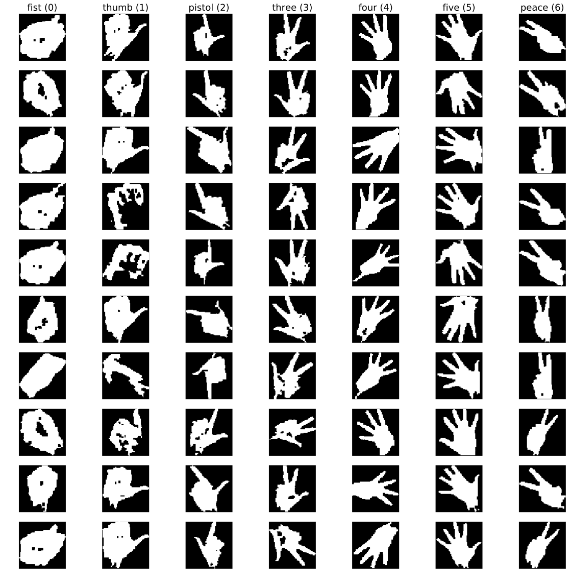

# Binary Hand Gesture Dataset

This notebook introduces a toy dataset for hand gesture classification for a school project I did back in 2011.
It is comprised of seven different gestures, with the hand already pre-segmented from the background in a 64x64px binary image.
The data is distributed as a HDF5 file and can be found along with this notebook at [`https://github.com/stes/gestures`](https://github.com/stes/gestures).


```python
classmap = {"fist"   : 0,
            "five"   : 5,
            "four"   : 4,
            "pistol" : 2,
            "three"  : 3,
            "thumb"  : 1,
            "peace"  : 6}

idx2cl = [{v:k for k, v in classmap.items()}[i] for i in range(7)]
```

Data loading is simple using the `h5py` package:


```python
with h5py.File('data/gestures_64px.hdf5') as ds:
    yt = ds['yt'][:]
    yv = ds['yv'][:]

    Xt = ds['Xt'][:]
    Xv = ds['Xv'][:]

print("The {} dataset contains {} samples of size {}x{}".format('train', *Xt.shape))    
print("The {} dataset contains {} samples of size {}x{}".format('test', *Xv.shape))    
```

    The train dataset contains 9724 samples of size 64x64
    The test dataset contains 667 samples of size 64x64


```python
def plot_overview(X, y):
    fig, axes = plt.subplots(10,7,figsize=(20,20))

    for i, row in enumerate(axes):
        for j, ax in enumerate(row):
            if i == 0: ax.set_title('{} ({})'.format(idx2cl[j], j))
            ax.imshow(X[y == j][i], cmap = "gray")
            ax.axis("off")
```

### Training Dataset

Let us now plot an overview of the training dataset


```python
sns.set_context("notebook", font_scale=1.5)

plot_overview(Xt, yt)
plt.savefig("img/overview_train.svg", bbox_inches='tight')
plt.close()
```


### Test Dataset

And another overview of the test dataset


```python
sns.set_context("notebook", font_scale=1.5)

plot_overview(Xv, yv)
plt.savefig("img/overview_test.svg", bbox_inches='tight')
plt.close()
```



## Classification Experiments

Here are some quick experiments using the data for building classification models.
The parameters are not tuned in any sense, so feel free to play around and improve the scores of the model.
The task should be fairly easy when using a CNN.
For the experiments I originally did with the dataset, I obtained an accuracy of ~90% with a fairly simple two-layer net on a handcrafted feature vector.


```python
preproc = lambda x : x[:,::2,::2].reshape(len(x), -1)

pca = PCA(n_components=20)

models = {
    'LDA' : LinearDiscriminantAnalysis(),
    'SVM RBF C = .1' : SVC(kernel="rbf", C = .1),
    'SVM RBF C = 10' : SVC(kernel="rbf", C = 10)
}

for name, classifier in models.items():

    model = Pipeline((('pca', pca), (name, classifier)))

    model.fit(preproc(Xt), yt)
    pt = model.predict(preproc(Xt)) #.argmax(axis=-1)
    pv = model.predict(preproc(Xv)) #.argmax(axis=-1)

    print(name)
    print("Training")
    print(classification_report(yt, pt, target_names=[idx2cl[i].upper() for i in range(7)]))
    print("")
    print("Testing")
    print(classification_report(yv, pv, target_names=[idx2cl[i].upper() for i in range(7)]))
    print("\n" + "-"*75+"\n")
```

    LDA
    Training
                 precision    recall  f1-score   support

           FIST       0.84      0.85      0.84      1738
          THUMB       0.81      0.74      0.77      1412
         PISTOL       0.49      0.46      0.48      1249
          THREE       0.53      0.61      0.57      1461
           FOUR       0.41      0.43      0.42       710
           FIVE       0.76      0.65      0.70      1338
          PEACE       0.70      0.74      0.72      1816

    avg / total       0.68      0.67      0.67      9724


    Testing
                 precision    recall  f1-score   support

           FIST       0.57      0.36      0.44       107
          THUMB       0.55      0.60      0.57       108
         PISTOL       0.37      0.45      0.40        92
          THREE       0.38      0.40      0.39        91
           FOUR       0.41      0.26      0.32       131
           FIVE       0.45      0.36      0.40        75
          PEACE       0.37      0.76      0.49        63

    avg / total       0.45      0.43      0.43       667


    ---------------------------------------------------------------------------

    SVM RBF C = .1
    Training
                 precision    recall  f1-score   support

           FIST       1.00      1.00      1.00      1738
          THUMB       1.00      1.00      1.00      1412
         PISTOL       0.99      0.99      0.99      1249
          THREE       0.99      0.99      0.99      1461
           FOUR       1.00      0.97      0.98       710
           FIVE       1.00      1.00      1.00      1338
          PEACE       1.00      1.00      1.00      1816

    avg / total       0.99      0.99      0.99      9724


    Testing
                 precision    recall  f1-score   support

           FIST       0.69      0.51      0.59       107
          THUMB       0.85      0.58      0.69       108
         PISTOL       0.38      0.97      0.55        92
          THREE       0.89      0.46      0.61        91
           FOUR       0.92      0.85      0.89       131
           FIVE       0.82      0.48      0.61        75
          PEACE       0.87      0.92      0.89        63

    avg / total       0.78      0.68      0.69       667


    ---------------------------------------------------------------------------

    SVM RBF C = 10
    Training
                 precision    recall  f1-score   support

           FIST       1.00      1.00      1.00      1738
          THUMB       1.00      1.00      1.00      1412
         PISTOL       1.00      1.00      1.00      1249
          THREE       1.00      1.00      1.00      1461
           FOUR       1.00      1.00      1.00       710
           FIVE       1.00      1.00      1.00      1338
          PEACE       1.00      1.00      1.00      1816

    avg / total       1.00      1.00      1.00      9724


    Testing
                 precision    recall  f1-score   support

           FIST       0.69      0.52      0.60       107
          THUMB       0.89      0.57      0.70       108
         PISTOL       0.41      0.97      0.58        92
          THREE       0.95      0.46      0.62        91
           FOUR       0.82      0.91      0.86       131
           FIVE       0.82      0.49      0.62        75
          PEACE       0.86      0.89      0.88        63

    avg / total       0.78      0.69      0.69       667


    ---------------------------------------------------------------------------


## Principal Component Analysis

Here I show the filters obtained by a PCA used as a pre-processing step in the model before.


```python
fig, axes = plt.subplots(2,10,figsize=(20,5))

for i, ax in enumerate(axes.flatten()):
    ax.imshow(pca.components_[i].reshape(32,32), cmap="coolwarm")
    ax.axis("off")
plt.suptitle("Principal Components")
plt.savefig("img/pca.svg", bbox_inches="tight")
plt.close()
```


## License/Contact

If you have any questions regarding the dataset, feel free to [contact me](stes.io).

You are free to use the dataset under the terms of the CC BY 4.0 license.

<a rel="license" href="http://creativecommons.org/licenses/by/4.0/"></a><br />This work is licensed under a <a rel="license" href="http://creativecommons.org/licenses/by/4.0/">Creative Commons Attribution 4.0 International License</a>.
